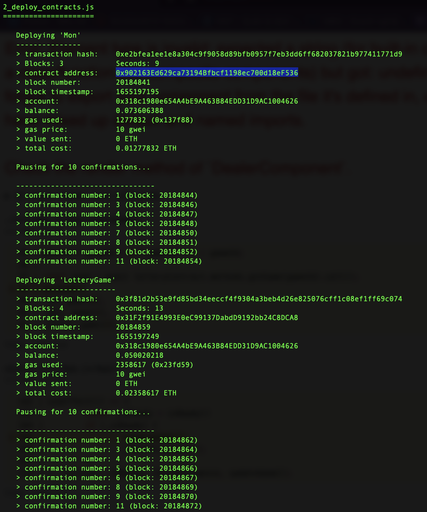
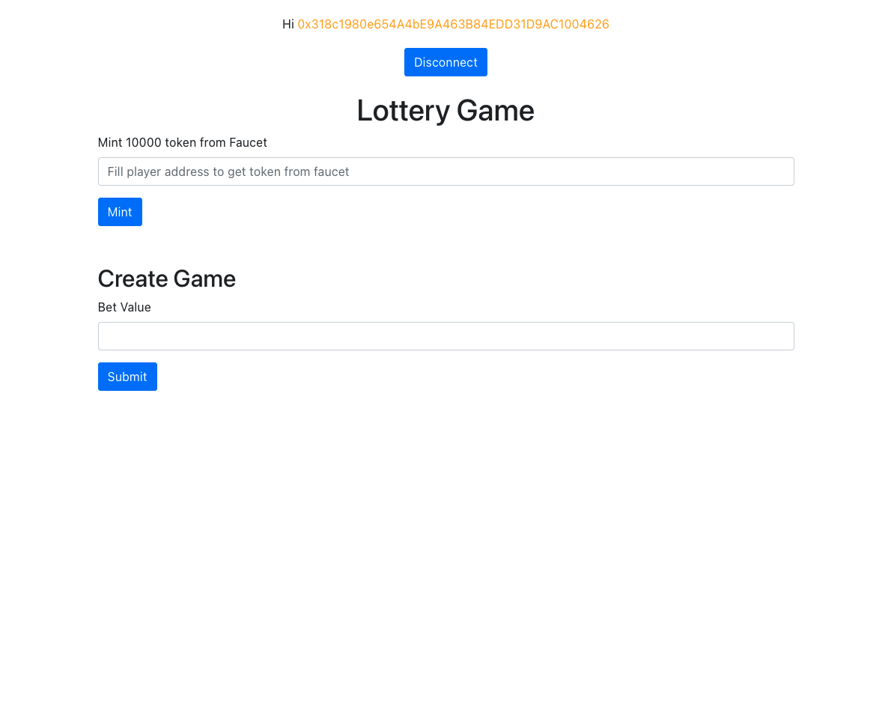
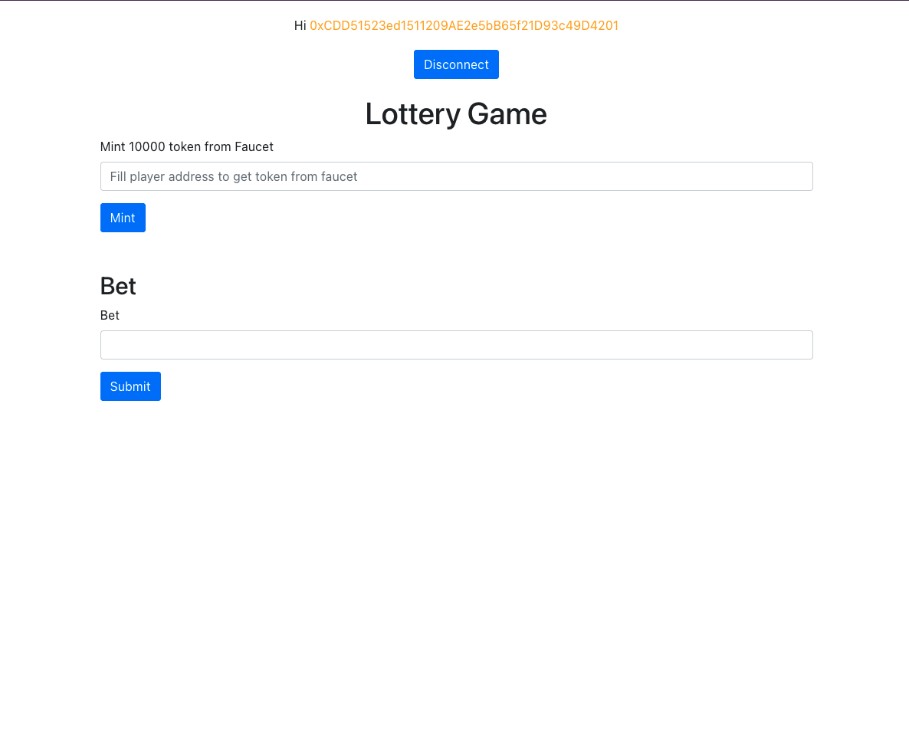
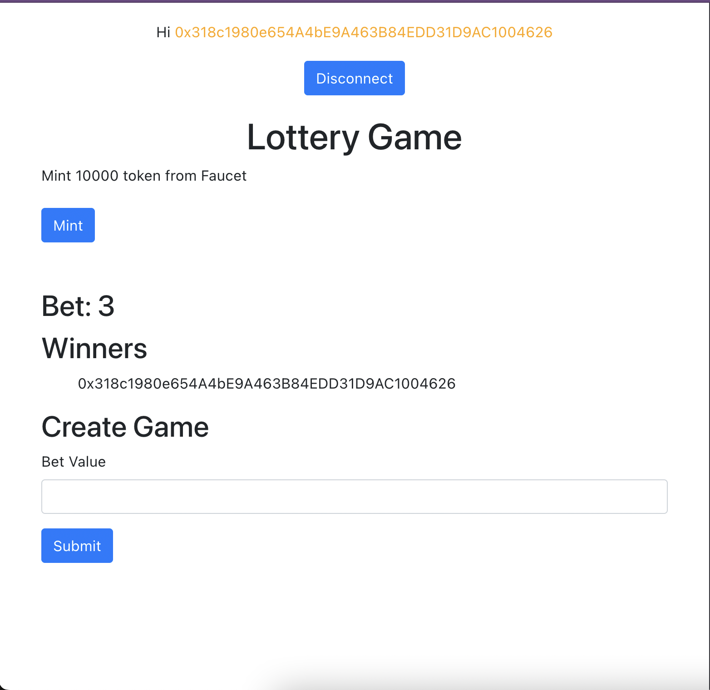

# The lottery game 

## Solution 

Smart Contract:
- Lottery Game: https://testnet.bscscan.com/address/0x31F2f91E4993E0eC99137DabdD9192bb24C8DCA8
- ERC20 Token: https://testnet.bscscan.com/address/0x902163Ed629ca73194Bfbcf1198ec700d18eF536

Unit Tests -> [Here](./test/)

UI -> [Here](./client/)

Require: BNB from [faucet](https://testnet.binance.org/faucet-smart)

Deploy with [Truffle](https://trufflesuite.com/) and [BnB Chain Testnet](https://data-seed-prebsc-1-s3.binance.org:8545/)

Results:
- 
- 
- 
- 

## Requirement

Let's write a smart contract describing a lottery game. A player plays the start game by depositing 1 native coin/token and bet a number. 

The dealer who will deploy the smart contract to blockchain, can stop the game. When the game is stopped and pick the timestamp or block number is the winner. Ex: the dealer call stop at block no:xxxx15 => the player who is pick 15 is the winner. (you can choose timestamp is ok)
The game:
- There are max 100 players at the same time.
- Dealer cannot be a player.
- Betting number from 00 -> 99.
- 1 player can bet only 1 time.
- 10% of the total deposit will be returned to the dealer.
- If no one wins the game, the dealer will get all.
- If there are more than 1 winner, the coin/token will be shared.
- All token/coin will be stored at a smart contract or a public account that anyone can view.
- No one can play if the game is closed.

Technical description:
- Programming language/platform: you can use any programming language or platform.
Nice to have if you use solidity or rust.
- Blockchain network: you can use any network having an open testnet. Bsc, avax, eth,
solana, neo etc are welcome.
- Source code: any source code please upload to an open github and give us a link to
access it and give us a description in blockchain to describe your solution and how to
play with it (UI to play with it).
- Nice to have: the requirement is to use native coin of the blockchain but it’s a big plus if
you can use a token (erc20/sp, etc) to play the game.
- Nice to have: UI/Postman page to play with it.